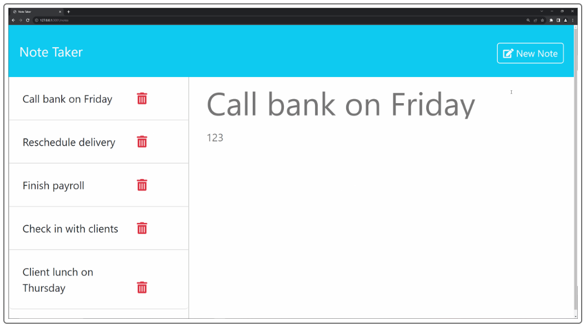
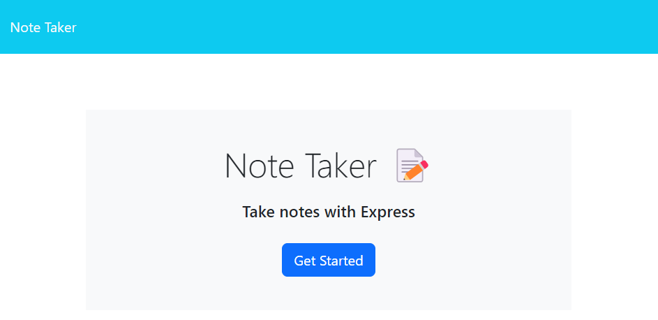
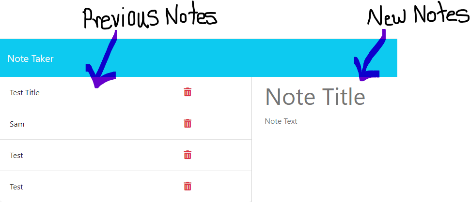
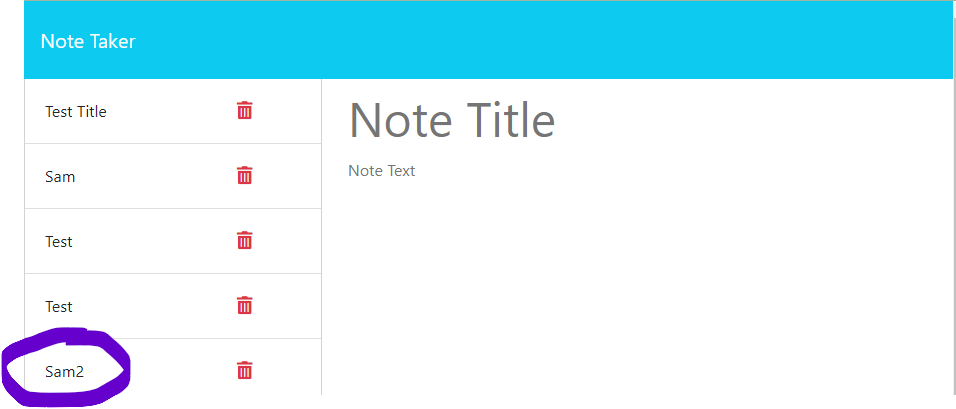
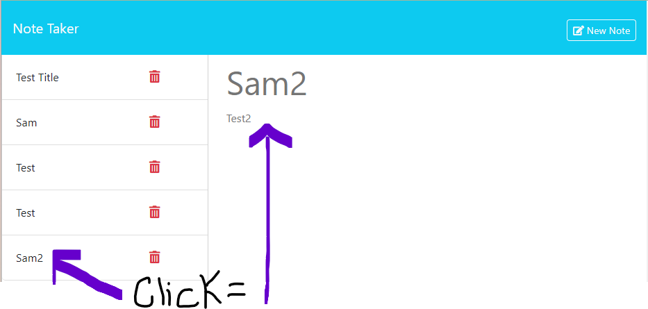

# 11-to-do-list
Express.js Challenge: Note Taker



**User Story**

AS A busy parent and small business owner

I WANT to be able to write a to-do-list and save detailed notes

SO THAT I can stay organized and productive each day

**Acceptance Criteria**

WHEN I open the Note Taker application

THEN I am presented with a landing page with a link to a notes page



WHEN I click 

THEN I am presented with a page with existing notes listed in the left-hand column, plus empty fields to enter a new note title and the note’s text 
in the right-hand column



WHEN I enter a new note title and the note’s text


THEN a "Save Note" button and a "Clear Form" button appear in the navigation at the top of the page


WHEN I click on the 

THEN the new note I have entered is saved and appears in the left-hand column with the other existing notes and the buttons in the navigation disappear



WHEN I click on an existing note in the list in the left-hand column



THEN that note appears in the right-hand column and a  button appears in the navigation

WHEN I click on  in the navigation at the top of the page

THEN I am presented with empty fields to enter a new note title and a new note in the right-hand column and that button disappears

WHEN I want to delete a note I click on the 

THEN any notes with a unique identifier provided from the UUIDV4 Library will be deleted to make room for new notes!

# References

I used lessons from our class materials as well as referenced my tutor and askBCS along with sources provided by them listed below.

Tutor-Benicio Lopez 

```javascript
//Middleware
app.use(express.json())
app.use(express.urlencoded({extended:true}))
app.use(express.static("public"))
app.use("/", htmlRoutes)
```
and 

UUIDV4 library

 [npm.js.com](www.npmjs.com/package/uuidv4) 

Learning Assistant- ask-300573 (Ntsika Silvano @nsilvano)

[iamwebwiz.medium.com](iamwebwiz.medium.com/how-to-fix-dirname-is-not-defined-in-es-module-scope-34d94a86694d)

*Bonus Reference*

router.delete()
[stackoverflow.com](stackoverflow.com/questions/68613707/how-to-fix-router-delete-which-is-not-working-express)

**My Git Hub Information**

*Profile:* 
https://github.com/SamGreenwood84/11-to-do-list.git

*Repo:*
git@github.com:SamGreenwood84/11-to-do-list.git

*Render Deployment*
```java
const port = process.env.PORT || 3001
```
